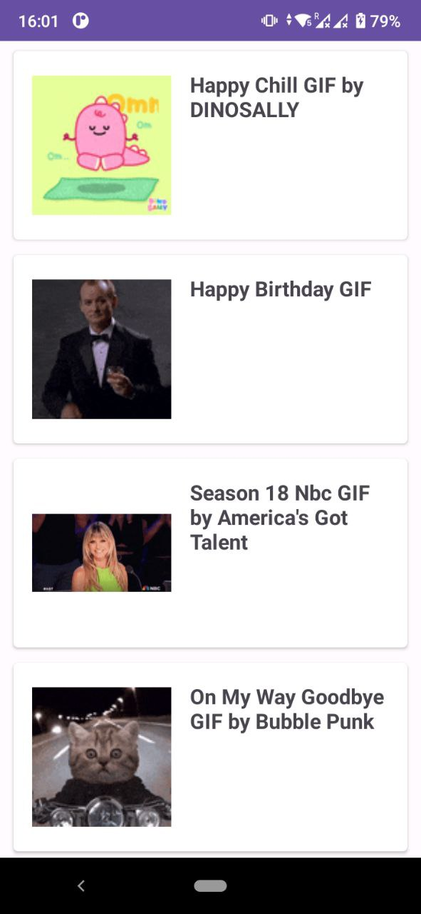
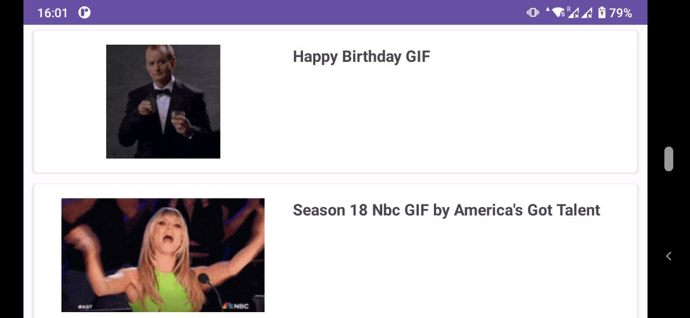
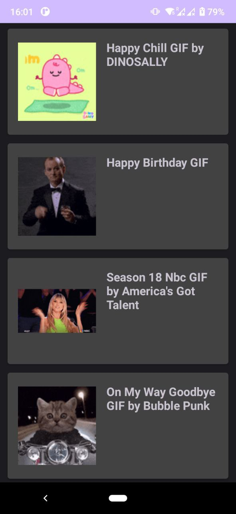

## **GIF HarborApi**
This application allows users to browse GIFs obtained from a Rest API. **To run the app, you will need to register for an API KEY from here:** https://developers.giphy.com/docs/api#quick-start-guide

## Key Features

* Displaying GIFs in a user-friendly list.
* Implementation of Clean Architecture principles.
* Dependency injection with Hilt 2.
* MVVM 
* Coroutines 
* REST API 

